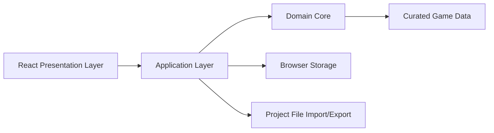

# AIC Planner Architecture Design

## 1. Purpose

This document translates the product requirements in the PRD into an implementation-oriented architecture for the Arknights: Endfield AIC Planner MVP.

The goal is to give the project a clear technical direction before coding starts, especially around:

- frontend framework and app structure
- in-memory planner and domain data model
- hardcoded game-data organization
- import/export and encode/decode boundaries

This design intentionally optimizes for a browser-first MVP, fast iteration, local-first persistence, and future extensibility without overbuilding V2 features.

## 2. Design Goals

The architecture should make the following easy to build and safe to evolve:

- site-accurate grid placement with collision and rule validation
- first-class machine modes and directional flow connections
- steady-state throughput analysis and plain-language diagnostics
- local autosave plus reliable file export/import
- curated, versioned game data that is independent from UI code

The architecture should avoid:

- coupling planner logic to React components
- mixing immutable catalog data with mutable user project state
- inventing a game-native blueprint format before the MVP proves itself
- requiring a server for normal use

## 3. Architectural Summary

The MVP should be implemented as a desktop-first `React + Vite` single-page app with a framework-agnostic TypeScript domain core.

The app should have three layers:

1. `presentation`
   React UI for canvas editing, inspector panels, encyclopedia browsing, dialogs, and keyboard-driven workflows.
2. `application`
   Editor commands, store orchestration, undo/redo, selectors, autosave, import/export workflows, and coordination between UI and domain logic.
3. `domain`
   Pure TypeScript types and functions for dataset loading, plan modeling, rule validation, diagnostics, throughput analysis, and codecs.

React should not contain business rules. The UI should call application commands such as `placeNode`, `moveNode`, `connectPorts`, `setNodeMode`, `exportProject`, or `importProject`, and those commands should delegate to the domain layer.

## 4. Why React + Vite

`React + Vite` is the best fit for this project because:

- the product is explicitly a browser-first desktop-style app
- it benefits from a rich interactive canvas and panel UI
- Vite gives fast iteration with low framework overhead
- the project does not currently need server rendering, routing conventions, or backend coupling

This also keeps the path open for a future desktop wrapper such as Tauri without changing the planner core.

The MVP should stay pure browser for now. Desktop packaging should be treated as a future shell concern, not a current architecture driver.

## 5. High-Level System Shape



Key rule: the same domain core should be usable from tests, the browser app, and future tooling scripts without React.

## 6. Proposed Source Layout

The codebase should be organized around responsibility rather than technical fashion:

```text
src/
  presentation/
  application/
  domain/
game-data/
docs/
```

Recommended responsibilities:

- `src/presentation/`
  React components, app shell, canvas rendering, inspector UI, encyclopedia UI, dialogs, hotkeys
- `src/application/`
  client store, editor actions, derived selectors, autosave coordinator, import/export coordinator
- `src/domain/`
  entity types, plan operations, dataset schemas, validation rules, analysis engine, codecs
- `game-data/`
  domain-sliced hardcoded JSON files and dataset manifest

## 7. Core Domain Model

### 7.1 Canonical Project Aggregate

The canonical saved and in-memory project should be `PlanDocument`.

Suggested shape:

```ts
type PlanDocument = {
  formatVersion: string;
  datasetVersion: string;
  metadata: PlanMetadata;
  siteConfig: SiteConfig;
  nodes: Record<NodeId, PlanNode>;
  edges: Record<EdgeId, PlanEdge>;
  uiState?: PersistedUiState;
};
```

Important rule: `PlanDocument` should store the layout scene and explicit connections as source of truth. Diagnostics, throughput summaries, production-line grouping, and bottleneck analysis should be derived from it.

This keeps saved files stable and understandable while avoiding duplicated analysis state.

### 7.2 Core Entities

Suggested domain entities:

- `PlanMetadata`
  project name, created/updated timestamps, optional notes
- `SiteConfig`
  chosen site preset id, site-level overrides, external input caps
- `PlanNode`
  one placed instance on the planner
- `PlanEdge`
  one directional connection between compatible ports
- `Diagnostic`
  plain-language validation or analysis finding
- `AnalysisResult`
  throughput summaries, bottlenecks, disconnected ports, blocked outputs, warnings

### 7.3 PlanNode

Suggested `PlanNode` fields:

```ts
type PlanNode = {
  id: NodeId;
  catalogId: MachineTypeId | LogisticsTypeId;
  kind: "machine" | "logistics" | "io";
  position: GridPoint;
  footprint: GridSize;
  rotation?: Rotation;
  modeId?: ModeId;
  settings: Record<string, unknown>;
};
```

Design notes:

- `catalogId` links to immutable reference data
- `modeId` is stored on the placed node because modes are user choices, not defaults only
- `settings` allows MVP flexibility without prematurely freezing every machine-specific field into the top-level shape

### 7.4 PlanEdge

Suggested `PlanEdge` fields:

```ts
type PlanEdge = {
  id: EdgeId;
  sourceNodeId: NodeId;
  sourcePortId: PortId;
  targetNodeId: NodeId;
  targetPortId: PortId;
};
```

This keeps connection logic explicit and stable. The planner should not infer connections from proximity.

### 7.5 Derived State vs Stored State

The following should be derived, not saved as canonical truth:

- collision results
- invalid placement results
- disconnected inputs and outputs
- blocked outputs
- throughput per node or edge
- bottlenecks
- computed production lines or subgraphs

The following should be stored:

- selected site preset
- project-level input caps
- placed node positions
- node modes and settings
- explicit edges
- lightweight UI preferences only if preserving them improves continuity

## 8. Immutable Reference Data Model

The planner needs a clean separation between reference data and project instances.

Suggested top-level dataset interface:

```ts
type DatasetBundle = {
  version: string;
  materials: Record<MaterialId, Material>;
  machineTypes: Record<MachineTypeId, MachineType>;
  recipes: Record<RecipeId, Recipe>;
  modes: Record<ModeId, MachineMode>;
  sitePresets: Record<SitePresetId, SitePreset>;
  rules: RuleFragment[];
};
```

Reference data should be immutable after load. User edits should only change `PlanDocument`.

This avoids a common failure mode where imported plans accidentally mutate shared catalog definitions or UI state starts depending on mixed mutable structures.

## 9. Game-Data Strategy

### 9.1 Format Choice

Hardcoded game data should live in JSON, not YAML or TypeScript constants.

Why JSON:

- easy to diff and validate
- straightforward to load in browser tooling
- consistent with future project-file JSON codecs
- clean separation between content and application logic

YAML would improve comments, but it adds another translation layer for little MVP benefit. TypeScript constants would improve type inference, but they would blur the line between content and code and make future data refreshes harder.

### 9.2 File Organization

Use domain-sliced JSON files:

- `game-data/materials.json`
- `game-data/machine-types.json`
- `game-data/recipes.json`
- `game-data/site-presets.json`
- `game-data/rules.json`
- `game-data/dataset-manifest.json`

This is a good middle ground:

- simpler than one file per record
- easier to review than one giant monolith
- ready for a later validation/build step

### 9.3 Record Design Rules

All records should use stable ids and references.

For example:

- materials reference no duplicated machine information
- recipes reference input and output material ids
- machine types reference supported mode ids and port definitions
- site presets reference geometry and site-specific rule ids
- rules may reference target machine types, site presets, or generic behaviors

Avoid embedding copies of the same rules in multiple records. Prefer id-based references with a small number of well-defined fragments.

### 9.4 Confidence and Provenance

Because Endfield public data may be incomplete or disputed, records should support provenance metadata:

```ts
type SourceMeta = {
  sourceConfidence: "verified" | "probable" | "partial" | "unknown";
  sourceNotes?: string;
  sourceUrls?: string[];
};
```

This metadata should be available to the UI so the planner can show uncertainty instead of pretending to have false precision.

## 10. Planner Engine Model

### 10.1 Canonical Model

The canonical planner model should be a layout-first scene with an explicit connection graph.

This is better than a pure logical graph because the product is fundamentally a layout editor:

- site geometry matters
- object footprint matters
- collision and blocked zones matter
- users think in placement and routing first, not in abstract production graphs

The analysis engine should derive a production graph from the current scene and connections.

### 10.2 Validation Passes

Validation should be structured as several passes instead of one monolithic function:

1. dataset integrity validation
2. site geometry validation
3. placement and footprint validation
4. connection compatibility validation
5. machine-mode requirement validation
6. site-level cap validation
7. throughput and bottleneck analysis

This makes findings easier to explain and easier to test.

### 10.3 Analysis Model

The MVP should use a steady-state deterministic analysis model.

That means:

- no tick simulation
- no animation-driven machine state model
- no queues or time progression engine in V1

Instead, each valid node/mode combination exposes deterministic input and output behavior. The analysis engine propagates those relationships through the connection graph and reports:

- missing required upstream inputs
- blocked or unused outputs
- exceeded external input caps
- bottlenecked nodes or links
- potentially disconnected subgraphs

This is aligned with the PRD and keeps the engine understandable for both developers and players.

## 11. Application Layer Design

The application layer should use a lightweight store, such as Zustand or an equivalent thin state container.

This store should coordinate:

- current `PlanDocument`
- currently loaded `DatasetBundle`
- current selection and inspector context
- current analysis result and diagnostics
- undo/redo stacks
- autosave status
- import/export progress and warnings

The store should not become a second domain model. Keep domain logic in pure functions and use the store mainly for orchestration and subscription.

Recommended application responsibilities:

- issue domain commands when the user edits the plan
- re-run analysis after relevant edits
- expose memo-friendly selectors to the UI
- debounce autosave
- surface import warnings and dataset mismatch information

## 12. Presentation Layer Design

The presentation layer should be a split workbench that directly reflects the PRD:

- planner canvas
- inspector/details area
- encyclopedia/reference pane

Suggested top-level UI structure:

- `AppShell`
- `ProjectSidebar` or header controls
- `PlannerCanvas`
- `SelectionInspector`
- `ReferencePane`
- `DiagnosticsPanel`

The canvas should feel like a node-editor-style planner, but the rendering model should remain grid-aware rather than freeform vector-only.

The UI should consume:

- selectors from the application layer
- command functions from the application layer
- plain-language diagnostics from the domain layer

The UI should not recalculate game rules on its own.

## 13. Import/Export and Encode/Decode

### 13.1 File Format Positioning

The MVP source-of-truth exchange format should be a readable versioned JSON file.

This should be the only required external format for the first release.

Share codes or compressed strings should be anticipated, but not treated as first-class MVP deliverables yet.

### 13.2 File Shape

Suggested file envelope:

```ts
type ProjectFile = {
  formatVersion: string;
  datasetVersion: string;
  exportedAt: string;
  payload: PlanDocumentPayload;
};
```

`payload` should contain:

- metadata
- selected site preset
- input caps
- node list
- edge list
- node modes and settings
- optional lightweight UI restore state

### 13.3 Import Pipeline

The import pipeline should be:

1. parse raw JSON
2. validate against file schema
3. normalize into internal types
4. validate references against current dataset
5. emit warnings for deprecated, missing, or unknown compatible fields
6. return a normalized `PlanDocument` and `ImportResult`

Suggested `ImportResult`:

```ts
type ImportResult = {
  plan: PlanDocument | null;
  warnings: ImportWarning[];
  errors: ImportError[];
};
```

### 13.4 Compatibility Policy

The default compatibility policy should be best-effort import, not strict rejection.

That means:

- preserve known fields even if some optional future fields are unknown
- warn when a referenced site, machine, or mode no longer exists
- keep the file readable whenever enough data survives to show the user something useful

Reject only when the file is fundamentally unparseable or the minimum structure needed to recover the plan is absent.

### 13.5 Export Pipeline

Export should serialize from canonical in-memory plan state only.

Do not export cached diagnostics or derived throughput summaries as authoritative data. Those can be recomputed after import.

This prevents stale or inconsistent analysis snapshots from becoming part of the persistence contract.

### 13.6 Future Share Codec

The design should reserve a second codec boundary:

- `projectFileCodec`
- `shareCodec`

The future `shareCodec` can compress the same logical payload into a compact string for copy/paste workflows without changing the internal plan model.

## 14. Local Persistence

The MVP should autosave to browser storage.

Recommended approach:

- autosave the current `PlanDocument`
- store recent project metadata separately for quick reopen
- keep autosave format aligned with the main project codec whenever practical

This reduces the risk that local persistence and exported files evolve into incompatible formats.

## 15. Diagnostics Design

Diagnostics should be first-class domain outputs, not ad hoc UI messages.

Recommended diagnostic shape:

```ts
type Diagnostic = {
  id: string;
  severity: "info" | "warning" | "error";
  code: string;
  message: string;
  subjectRefs: DiagnosticSubjectRef[];
  remediation?: string;
};
```

Diagnostics should support:

- attachment to site, node, edge, or global project scope
- stable codes for testing and filtering
- human-readable messages for regular players
- optional remediation suggestions

This lets the same diagnostic power:

- canvas overlays
- inspector messages
- summary panels
- import warning reporting

## 16. Testing Strategy

The architecture should be validated through tests at several levels.

### 16.1 Dataset Tests

- reject broken ids or missing references
- accept valid data bundles
- preserve `sourceConfidence` and `sourceNotes`

### 16.2 Domain Tests

- place, move, and remove nodes
- detect footprint and blocked-zone conflicts
- connect and disconnect valid or invalid ports
- update machine behavior when mode changes

### 16.3 Analysis Tests

- disconnected inputs and outputs
- blocked outputs
- exceeded input caps
- bottleneck detection on small known graphs

### 16.4 Codec Tests

- export/import round trips preserve layout fidelity
- older versions migrate or warn correctly
- unknown optional fields do not crash import
- unknown machine or site references surface warnings

### 16.5 Application Tests

- autosave/load wiring
- selectors keep inspector and encyclopedia context in sync
- import/export actions surface warnings and update state correctly

## 17. Delivery Guidance

The implementation should start by establishing boundaries, not UI polish.

Recommended order:

1. project scaffold and tooling
2. domain types and dataset schemas
3. dataset loader and validation
4. plan document operations
5. diagnostics and steady-state analysis
6. file codec and autosave
7. lightweight application store
8. basic split-pane React shell
9. canvas editing interactions
10. inspector, encyclopedia, and diagnostics surfaces

This ordering gives the UI a stable backbone instead of forcing repeated rewrites of business logic.

## 18. Non-Goals For This Architecture

This design does not commit the MVP to:

- SSR or a backend service
- collaboration or cloud sync
- official blueprint compatibility
- auto-optimization
- a live data crawler
- time-step simulation
- desktop packaging constraints

## 19. Final Recommendation

The project should move forward with a browser-first `React + Vite` app, a pure TypeScript domain core, JSON-based curated game data, and a versioned JSON project codec built around a canonical `PlanDocument`.

That combination is the best balance of:

- implementation speed
- testability
- data integrity
- user-facing reliability
- future extensibility

It is narrow enough to keep the MVP moving and flexible enough to support later improvements such as richer diagnostics, share codes, dataset refresh tooling, and desktop packaging.
